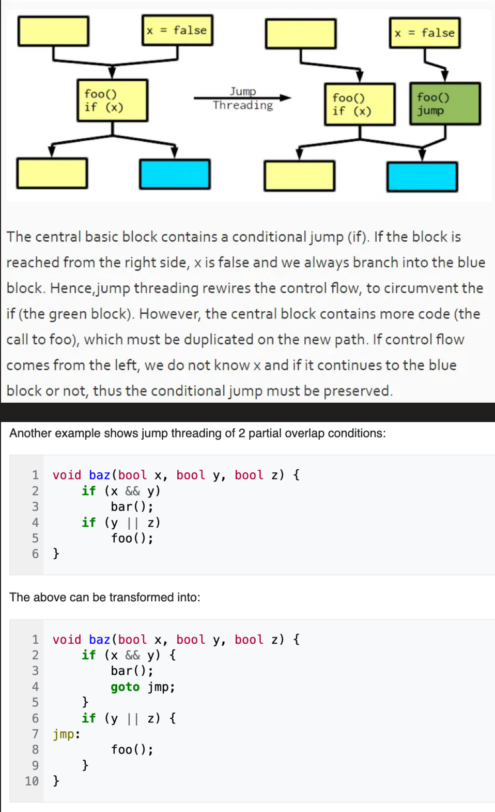

# 6.控制流还原：通用方法

控制流还原是反编译器中端优化流程的最后几步了，其目标是将原有的CFG图，还原成 while/if/switch 组成的高层次结构。

控制流的结构还原是反编译中很重要的部分，还原出if分支，循环，switch语句，尤其是循环语句带有很多的高层语意信息。

## 为什么要进行还原？如何还原？

人类很难阅读并理解完全由jmp/goto跳转组合成的CFG结构图，因此还原出高层的控制流结构，能够极大的提升反编译结果的可读性。

## 介绍：传统控制流还原的实现

IDA和Ghidra的控制流还原技术均使用了“区间分析/结构分析”的经典编译器技术。这一理论来源与编译原理中的控制流分析技术。需要先介绍一个CFG流图关键的特性：可规约性（reducible）

### 可规约性（reducible）：

可规约性（reducible），这个词用来描述不够清楚，它的本质含义是“结构良好的流图”（well-structured），但是既然业界都这样说，那么后面还是用”可规约”这样来描述。

可归于的定义本身很复杂

一种定义方法是：如果图中的循环没有多个出口/多个入口，那么这个图一般而言就是可规约的。如果一个图不可规约，那么基于结构分析的技术，还原后一定会有goto语句（无法正确还原）。

**上面这个定义太难懂了。**

所以，在本单元的反编译器理论中，使用另一种简略的定义；对一个流图进行预定义的各种变幻，如果流图塌缩成单个结点，则称这个流图是可归约的，否则就是不可规约的。

如果一个图可规约，那么图中的循环就能被正确的还原出控制流（控制流还原的主要复杂读就是在于循环）

至于“塌缩”的意思，往下看。

### 区间分析与结构分析在反编译器中的运用

其基本原理即是：通过某一些列的规则将原有的流图不断的“塌缩”，最后成为一个点。

基础的规则如下。

### 塌缩规则

* 基础规则 - 连续两个基础块可以直接压缩成一个

<figure><figcaption></figcaption></figure>

* 循环规则-自循环

<figure><figcaption></figcaption></figure>

* 循环规则-while循环

<figure><figcaption></figcaption></figure>

* 循环规则-do+while循环

<figure><figcaption></figcaption></figure>

* 条件分支- if+then

<div align="center" data-full-width="false"><figure><figcaption></figcaption></figure></div>

* 条件分支- if+else+then

<figure><figcaption></figcaption></figure>

* 条件分支-switch+case

<figure><figcaption></figcaption></figure>

### 示例：

参考：《高级编译器设计与实现》第七章中的还原案例。

这里我标记了关键的变化信息。最终图塌缩到了一点。这也是IDA/Ghidra等实现的基础逻辑，不断的进行塌缩并对变换过程中影响到的基本块结构进行标记。最终还原出CFG中完整的高层控制流语义。

<figure><figcaption></figcaption></figure>


## 通用方案的难题：对于不可规约图的处理

通用的恢复方案存在一个难题：无法很好的处理正向编译产生的“不可归约”的CFG图，最终直接将边转为GOTO语句。为什么会这样呢？

对于源码来说，不可规约的情况很少很少；

例如，js这种不支持goto语句的语言，源码中基本上不会产生不可规约的情况。常见的流程控制指令 (例如IF、FOR、WHILE、BREAK、CONTINUE）都会产生可规约控制流图。

在支持goto语句，比如C语言中，源码中不可规约流图，常常出现在goto跳出多重循环等场景。

但是事情总会出岔子，编译器的总能给你找事情做。


参考我[之前的文章](https://bbs.kanxue.com/thread-278789.htm) “为什么IDA F5后的代码会有GOTO语句？” 中的案例：

优化前的代码：

```
int fun(int a, int b)
{
    int ret = 0;
    if (getchar() > 0x10) {
        ret = a+b;
    } else {
        ret = a-b;
        if (getchar()>0x20) {
            printf("hello");
            printf("ret=xx");
            return ret;
        }
    }
    printf("hi");
    printf("ret=xx");
    return ret;
}
```

编译器优化中发现， printf("ret=xx");  return ret; 这两句代码完全一致，为了减少代码量就插入一个goto语句将这两个尾部进行融合。优化后插入了goto。

```
int fun(int a, int b)
{
    int ret = 0;
    if (getchar() > 0x10) {
        ret = a+b;
    } else {
        ret = a-b;
        if (getchar()>0x20) {
            printf("hello");
            goto LABEL
        }
    }
    printf("hi");
LABEL:
    printf("ret=xx");
    return ret;
}

```

如下图

<figure><figcaption></figcaption></figure>

这样的编译器优化，也导致了IDA没有办法对这部分进行还原。如下图所示，IDA反编译的结果是一个典型的菱形结构，无法还原。

<figure><figcaption></figcaption></figure>

##
