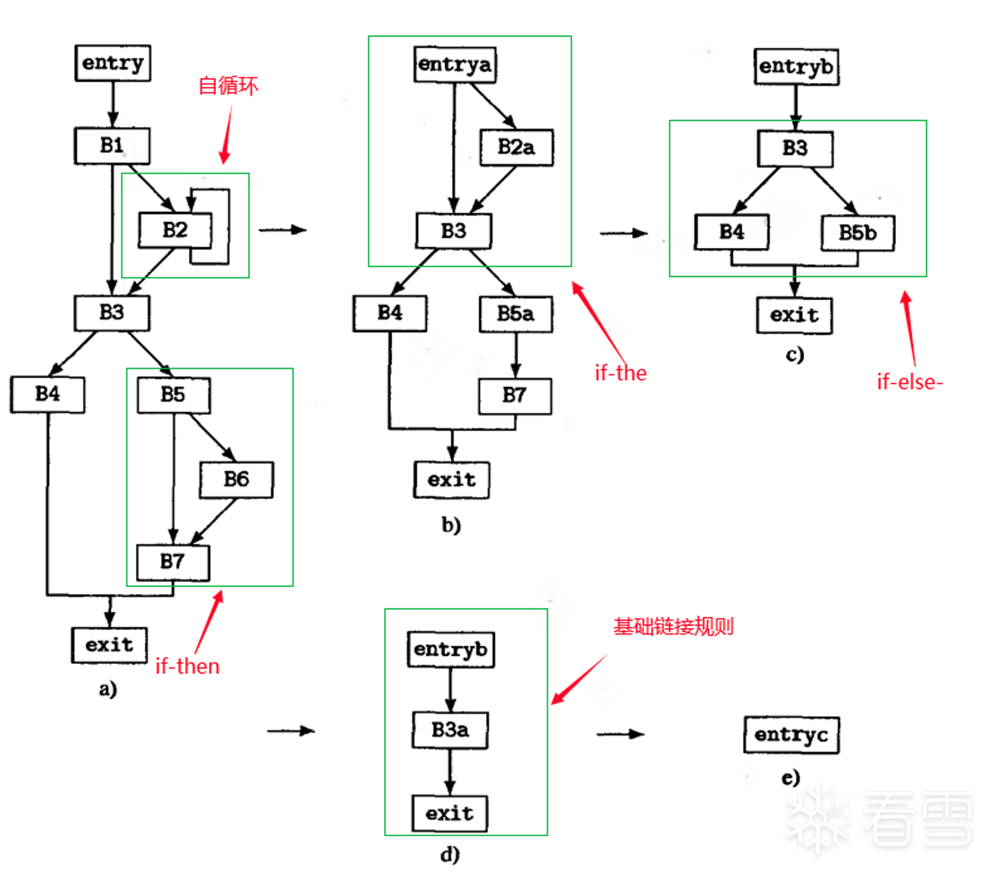

# 反混淆：字符串加密

字符串与常量加密也是常规的混淆方案，很常见。

这一章会介绍常见的字符串加密场景，以及静态对抗字符串加密混淆的常用方&#x6848;**。**

## 通用的字符串加密对抗

字符串加密有很多种小情况：解密的方式，什么时候解密，解密数据放到哪里，等等

总的来说，有这么几种通用的方法：

* Dump内存：如果解密逻辑都放在初始化中（比如JNI\_Onload 或者 init\_func），程序执行后Dump内存是一种很棒的方法。但是，现在复杂的混淆都会边执行函数边解密，这就使得dump内存的方法不那么好用了；还存在一些其它的情况，比如解密之后把数据加密回去。
* 模拟执行：模拟执行也是很通用的方法，通常用于对抗将字符串解密放到函数开头的场景。


还有一些小技巧，比如在IDA中，我们可以将\_\_DATA段设置为只读的，这样IDA通过常量计算的能力，在F5中能看到部分的数据。

## 独立的字符串解密函数

比较早期的字符串加密方案，将字符串全部加密存储后，运行时调用解密函数。

分析解密函数的逻辑后，通过XREF找到所有的调用点，分析传入的参数就能很容易的写出解密逻辑。

样例：

<figure><figcaption></figcaption></figure>

如上图，decrypt\_str\_buffer\_1CE30函数将会传入四个参数，进行解密；我们可以简单的编写脚本，进行解密，解密的结果如下：

<figure><figcaption></figcaption></figure>

下面是我写的一个简单的脚本

```
import flare_emu
import idc
import idaapi
import ida_bytes
import idautils
import keypatch


func_addr = 0
wait_string_addr = []
if func_addr == 0:
    func_addr = idaapi.get_screen_ea()
do_function = idaapi.get_func(func_addr)
flowchart = idaapi.FlowChart(do_function)
# 遍历流图中的所有function-call
for block in flowchart:
    # 打印当前basic-block的起始与结束地址
    # print("Basic-block: 0x%x - 0x%x" % (block.start_ea, block.end_ea))
    for head in idautils.Heads(block.start_ea, block.end_ea):
        if not idaapi.is_call_insn(head):
            continue
        call_name = idc.GetDisasm(head)
        if "decrypt_str_buffer_1CE30" not in call_name: 
            continue
        
        # 直接模拟获得返回值
        eh = flare_emu.EmuHelper()
        # 传入待选参数 endAddr，和第一个参数共同标识一段地址区间
        eh.emulateRange(block.start_ea, endAddr=head, skipCalls=True)
        p0 = eh.getRegVal("X0")
        p1 = eh.getRegVal("X1")
        p2 = eh.getRegVal("W2")
        p3 = eh.getRegVal("W3")
        if p0 == 0 or p1 == 0 or p2 ==0 or p3 == 0:
            continue
        print(f"call at {hex(head)}, x0={hex(p0)}, x1={hex(p1)}, x2={hex(p2)}, x3={hex(p3)}") 
        #wait_string_addr.append(ret)
        before_bytes = idaapi.get_bytes(p1, p3)
        result = ""
        xor_data = p2
        for each in before_bytes:
            result = result + chr(xor_data ^ each)
            xor_data = xor_data+3
        
        ida_bytes.patch_bytes(p0 ,result.encode()+ b"\x00")
        idc.create_strlit(p0, p0+p3)

        set_type = idc.parse_decl(f"const char[{p3}];",idc.PT_SILENT)
        idc.apply_type(p0, set_type)
```

配合着脚本，解释一些对抗中可能会遇到一些小问题：

* 如何获得函数传入的参数：静态还原工具不太好直接提取出，为了通用性上面的脚本使用了模拟执行，还有一种做法是向上解析汇编。
* 解密的结果在动态分配的内存：有的时候，解密的结果会放到malloc的内存中，通过一个全局或者局部的指针使用，这种情况解密的结果需要可能要处理内存对象，不太好处理，比较偷懒的办法就是加注释。

## 解密逻辑在每个函数头部

也是很常见的字符串加密，通常来说会有个原子atomic全局变量包裹，整个逻辑inline在每个函数的头部，

案例：

<figure><figcaption></figcaption></figure>

我通常使用模拟执行对抗。模拟执行头部，监控所有的\_\_data段写入；

参考下面我这个通用的代码：

> [https://github.com/wINfOG/IDA\_Easy\_Life/blob/main/emu\_fast\_string.py](https://github.com/wINfOG/IDA_Easy_Life/blob/main/emu_fast_string.py)
>
> [https://github.com/wINfOG/IDA\_Easy\_Life/blob/main/unicorn\_fast\_string.py](https://github.com/wINfOG/IDA_Easy_Life/blob/main/unicorn_fast_string.py)


## 解密逻辑在支配树父节点

可以说是上面的升级版本，这个方案会使得字符串加密逻辑更加的复杂，更加的细碎。

原理是：支配树中的父节点是当前basic-block的必经节点，因此只要将当前使用的字符串解密逻辑放到父节点里面去，就确保解密逻辑一定执行。

我没有找到比较合适的案例，因此这部分不再展开了，依照类似的思路应该是能够完成一个较为通用的方案：找到所有的basic-block块 ；判断里面的字符串解密部分；模拟执行或者模式匹配每个basic-block中的字符串解密；把数据填回去。


## 混合其他混淆的字符串加密

还有一个点不得不说，字符串加密通常不单独出现，他只是作为混淆的基坐。

最典型的场景是和OLLVM一起出现。这导致逻辑更加的难看懂。
